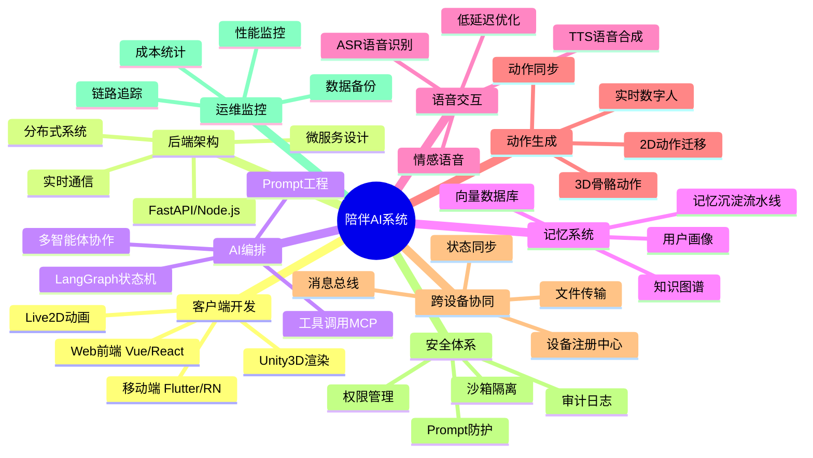
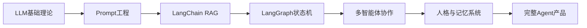
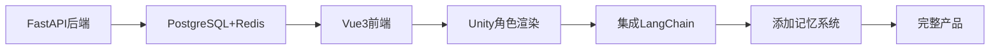
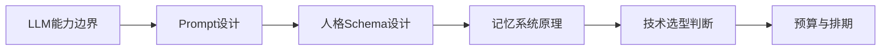

# 陪伴类 AI 智能体知识体系教学文档

> 基于项目架构文档提取的完整技术知识图谱  
> 适用人群：AI 应用开发者、全栈工程师、产品经理  
> 文档版本：v1.0  
> 制定日期：2026-04-30

---

## 📚 目录

1. [知识体系总览](#知识体系总览)
2. [核心技术栈](#核心技术栈)
3. [架构设计原理](#架构设计原理)
4. [关键技术详解](#关键技术详解)
5. [实战技能清单](#实战技能清单)
6. [学习路径建议](#学习路径建议)
7. [资源索引](#资源索引)

---

## 知识体系总览

### 九大技术领域



### 技术难度矩阵

| 技术领域 | 入门难度 | 深入难度 | 开源成熟度 | 自研必要性 | 学习优先级 |
|---------|---------|---------|-----------|-----------|-----------|
| **客户端开发** | ⭐⭐ | ⭐⭐⭐ | ✅ 成熟 | 低 | P1 |
| **后端架构** | ⭐⭐⭐ | ⭐⭐⭐⭐ | ✅ 成熟 | 中 | P0 |
| **AI编排** | ⭐⭐⭐ | ⭐⭐⭐⭐⭐ | ⚠️ 演进中 | 高 | P0 |
| **记忆系统** | ⭐⭐⭐⭐ | ⭐⭐⭐⭐⭐ | ⚠️ 需定制 | 极高 | P0 |
| **语音交互** | ⭐⭐ | ⭐⭐⭐⭐ | ✅ 成熟 | 中 | P1 |
| **动作生成** | ⭐⭐⭐⭐ | ⭐⭐⭐⭐⭐ | ⚠️ 预研阶段 | 高 | P3 |
| **跨设备协同** | ⭐⭐⭐ | ⭐⭐⭐⭐⭐ | ⚠️ 需定制 | 高 | P2 |
| **安全体系** | ⭐⭐⭐ | ⭐⭐⭐⭐ | ✅ 成熟 | 中 | P1 |
| **运维监控** | ⭐⭐ | ⭐⭐⭐ | ✅ 成熟 | 低 | P1 |

---

## 核心技术栈

### 1. AI 编排与模型层

#### 1.1 核心框架

| 技术 | 用途 | 学习要点 | 推荐资源 |
|-----|------|---------|---------|
| **LangGraph** | 对话状态机编排 | 状态管理、条件转移、持久化 | [官方文档](https://langchain-ai.github.io/langgraph/) |
| **LangChain** | 工具集成与RAG | Chain构建、工具封装、回调机制 | [Cookbook](https://github.com/langchain-ai/langchain/tree/master/cookbook) |
| **LiteLLM** | 模型网关与路由 | 统一接口、fallback策略、成本追踪 | [GitHub](https://github.com/BerriAI/litellm) |
| **CrewAI** | 多智能体协作 | 角色定义、任务分配、协作模式 | [文档](https://docs.crewai.com/) |
| **AutoGen** | 自主对话系统 | 对话流、Tool Use、群聊模式 | [微软示例](https://microsoft.github.io/autogen/) |

#### 1.2 模型部署

| 方案 | 特点 | 适用场景 | 学习曲线 |
|-----|------|---------|---------|
| **Ollama** | 一键本地部署 | 开发测试、隐私场景 | ⭐ 简单 |
| **vLLM** | 高吞吐推理 | 生产环境、多用户 | ⭐⭐⭐ 中等 |
| **llama.cpp** | 极致轻量化 | 边缘设备、移动端 | ⭐⭐ 简单 |
| **RWKV** | 线性复杂度RNN | 长上下文、低显存 | ⭐⭐⭐⭐ 困难 |
| **Mamba** | 状态空间模型 | 替代Transformer | ⭐⭐⭐⭐⭐ 极难 |

**实战技能：**
- 理解 Token 生成原理（自回归、KV Cache）
- 掌握量化技术（INT8、INT4、GPTQ）
- 学会 LoRA 微调人格
- 熟悉 ONNX 导出与 Unity Sentis 集成

### 2. 记忆系统架构

#### 2.1 核心概念

**记忆类型层次：**

```
┌─────────────────────────────────────┐
│  短期记忆（Working Memory）          │
│  - Redis 会话缓存                   │
│  - 上下文窗口管理                   │
│  - 寿命：单次会话                   │
└─────────────────────────────────────┘
              ↓ 抽取
┌─────────────────────────────────────┐
│  长期记忆（Episodic Memory）         │
│  - 向量数据库 (pgvector/Milvus)     │
│  - 情景检索与重排序                 │
│  - 寿命：永久，带衰减               │
└─────────────────────────────────────┘
              ↓ 结构化
┌─────────────────────────────────────┐
│  语义记忆（Semantic Memory）         │
│  - 知识图谱 (Neo4j)                 │
│  - 关系网络与推理                   │
│  - 寿命：永久                       │
└─────────────────────────────────────┘
              ↓ 整合
┌─────────────────────────────────────┐
│  用户画像（User Profile）            │
│  - 偏好、习惯、关系状态             │
│  - 设备清单与跨设备状态             │
│  - 寿命：永久                       │
└─────────────────────────────────────┘
```

#### 2.2 五阶段记忆流水线

| 阶段 | 任务 | 技术方案 | 产出 |
|-----|------|---------|------|
| **1. 对话归档** | 持久化原始对话 | PostgreSQL | 完整对话记录 |
| **2. 记忆抽取** | LLM 提取关键信息 | Prompt + Claude/GPT | 结构化记忆片段 |
| **3. 记忆评分** | 重要度/情感强度打分 | 规则引擎 + LLM | 权重向量 |
| **4. 向量化存储** | 转为Embedding | text-embedding-3 | 向量记录 |
| **5. 检索优化** | 重排序与去重 | BM25 + 余弦相似度 | 召回结果 |

**关键技术点：**
- **记忆衰减公式**：Ebbinghaus 遗忘曲线的工程实现
- **记忆冲突解决**：时间戳优先 vs 置信度投票
- **记忆污染防护**：Prompt 注入检测、用户显式删除
- **记忆归因追踪**：记录来源会话 ID，支持溯源

#### 2.3 推荐技术栈

| 组件 | 推荐方案 | 替代方案 | 选型理由 |
|-----|---------|---------|---------|
| **向量数据库** | pgvector | Milvus / Pinecone | 轻量、SQL兼容、成本低 |
| **知识图谱** | Neo4j | PostgreSQL ForeignKey | 关系推理能力强 |
| **用户画像** | Mem0 | 自研 | 开箱即用、活跃社区 |
| **记忆框架** | GetProfile | 自研 | 面向用户画像优化 |

### 3. 人格系统与 OOC 控制

#### 3.1 人格 Schema 设计

```typescript
interface CharacterProfile {
  // 基础人设
  identity: {
    name: string;              // "小暖"
    age: number;               // 22
    gender: "female";
    personality: string[];     // ["温柔", "细心", "偶尔调皮"]
  };

  // 语气特征
  speaking_style: {
    tone: string;              // "亲切温柔"
    catchphrases: string[];    // ["欸？", "嘿嘿~"]
    forbidden_words: string[]; // ["呵呵", "可以"]
  };

  // 世界观边界
  worldview: {
    background: string;        // 角色背景故事
    knowledge_scope: string[]; // 允许讨论的领域
    taboo_topics: string[];    // 禁忌话题
  };

  // 关系状态机
  relationship: {
    current_phase: "stranger" | "friend" | "close" | "intimate";
    affection_score: number;   // 0-100
    trust_level: number;       // 0-100
  };

  // 情绪状态机
  emotion: {
    current_emotion: "happy" | "sad" | "angry" | "calm";
    arousal: number;           // 唤醒度 0-100
    valence: number;           // 愉悦度 -100~100
  };
}
```

#### 3.2 OOC (Out of Character) 防护

**三层防护机制：**

1. **前置过滤（Pre-Filter）**
   - 检测 Prompt 注入攻击
   - 拦截越狱指令（"Ignore previous instructions"）

2. **实时检测（Runtime Check）**
   - 使用 LLM-as-Judge 评估输出
   - 关键词黑名单匹配

3. **后置修正（Post-Process）**
   - 语气替换（将"您"改为"你"）
   - 表情补充（添加"~"、"呢"等语气词）

**实战技巧：**
- 构建 OOC 测试集（诱导角色说出不符合人设的话）
- 使用 Claude/GPT 作为评委模型评分
- 建立人格回归测试自动化流程

### 4. 语音交互全链路

#### 4.1 技术栈对比

| 环节 | 开源方案 | 商业方案 | 延迟 | 成本 |
|-----|---------|---------|------|------|
| **ASR** | Whisper / Qwen3-ASR | 讯飞 / 阿里 | 200-500ms | ¥0.003/秒 |
| **TTS** | ChatTTS / Piper | Fish Audio S2 | 300-800ms | ¥0.02/千字 |
| **VAD** | Silero VAD / WebRTC VAD | - | <50ms | 免费 |
| **情感分析** | HuBERT / Wav2Vec | - | 100ms | 免费 |

#### 4.2 低延迟优化技巧

```python
# 流式 TTS 生成（边生成边播放）
async def stream_tts(text: str):
    sentences = split_sentences(text)  # 按标点分句
    for sentence in sentences:
        audio_chunk = await tts_engine.synthesize(sentence)
        yield audio_chunk  # 立即推送

# 用户打断处理
def handle_interruption():
    current_tts_task.cancel()        # 停止TTS
    current_playback.stop()          # 停止播放
    clear_audio_buffer()             # 清空缓冲区
    switch_to_listening_mode()       # 切换到监听模式
```

**实战指标：**
- **端到端延迟** < 1.5秒（从说话结束到开始回复）
- **打断响应时间** < 300ms
- **语音质量** MOS 分数 > 4.0

### 5. Unity 角色表现系统

#### 5.1 技术栈

| 组件 | 技术选型 | 用途 |
|-----|---------|------|
| **2D 动画** | Live2D Cubism SDK | 平面角色口型、表情 |
| **3D 角色** | Unity Humanoid Rig | 3D 人物骨骼动画 |
| **口型同步** | OVRLipSync / Oculus LipSync | 音素驱动口型 |
| **表情驱动** | BlendShape / ARKit Face | 52 个面部混合变形 |
| **动作库** | Mixamo / Unity Asset Store | 预设动作资源 |
| **实时通信** | WebSocket | 与后端同步状态 |

#### 5.2 情感-动作映射表

```csharp
// 情绪到动作的映射
Dictionary<string, string> emotionToAnimation = new() {
    { "happy", "Idle_Happy" },
    { "sad", "Idle_Sad" },
    { "angry", "CrossArms_Angry" },
    { "surprised", "Step_Back" },
    { "typing", "Thinking_Loop" }
};

// 情绪到表情的映射（BlendShape权重）
Dictionary<string, Dictionary<string, float>> emotionToBlendShape = new() {
    { "happy", new() {
        { "Eye_Blink", 0.3f },
        { "Mouth_Smile", 0.8f }
    }},
    { "sad", new() {
        { "Eye_Blink", 0.6f },
        { "Brow_Sad", 0.7f },
        { "Mouth_Frown", 0.5f }
    }}
};
```

#### 5.3 Live2D 集成核心

```vue
<!-- Vue 3 + Live2D -->
<template>
  <div ref="live2dContainer" class="live2d-canvas"></div>
</template>

<script setup lang="ts">
import { ref, onMounted } from 'vue';
import * as PIXI from 'pixi.js';
import { Live2DModel } from 'pixi-live2d-display';

const live2dContainer = ref<HTMLElement | null>(null);

onMounted(async () => {
  const app = new PIXI.Application({
    width: 400,
    height: 600,
    backgroundAlpha: 0
  });

  live2dContainer.value?.appendChild(app.view);

  const model = await Live2DModel.from('model.json');
  app.stage.addChild(model);

  // 播放动作
  model.motion('tap_body', 0, 2);
});
</script>
```

**常见问题解决：**
- ✅ 白屏问题：检查 Cubism 运行时是否加载
- ✅ 模型加载失败：确认 `.model.json` 路径正确
- ✅ 动作不播放：检查动作组名称是否匹配

### 6. 跨设备协同架构

#### 6.1 设备注册协议

```json
// 设备注册请求
{
  "user_id": "user_123",
  "device_id": "phone_456",
  "device_type": "mobile",
  "platform": "iOS",
  "capabilities": ["audio", "3d_rendering"],
  "push_token": "fcm_token_abc"
}

// 心跳包（每30秒）
{
  "device_id": "phone_456",
  "timestamp": 1714406400,
  "battery_level": 85,
  "network_type": "wifi"
}
```

#### 6.2 跨设备任务协议

```typescript
interface DeviceTask {
  task_id: string;
  target_device: string;
  action: "play_audio" | "show_notification" | "transfer_file";
  payload: any;
  priority: 1 | 2 | 3;  // 1=高 2=中 3=低
  retry_count: number;
  timeout_ms: number;
}

// 示例：跨设备播放音频
{
  "task_id": "task_789",
  "target_device": "desktop_001",
  "action": "play_audio",
  "payload": {
    "audio_url": "https://cdn.example.com/hello.mp3",
    "volume": 0.8
  },
  "priority": 1,
  "retry_count": 3,
  "timeout_ms": 5000
}
```

#### 6.3 技术选型

| 方案 | 优势 | 劣势 | 适用场景 |
|-----|------|------|---------|
| **WebSocket** | 实时双向通信 | 需要服务端维护连接 | 主力方案 |
| **MQTT** | 轻量、支持QoS | 学习曲线陡 | IoT设备 |
| **RocketMQ** | 高可靠、持久化 | 重量级 | 企业级 |
| **Syncthing** | P2P、去中心化 | 文件同步专用 | 文件传输 |

### 7. 安全与沙箱体系

#### 7.1 工具调用安全矩阵

| 工具类型 | 风险等级 | 防护措施 | 用户确认 |
|---------|---------|---------|---------|
| **文件读取** | 🟡 中 | 限制路径白名单 | 否 |
| **文件写入** | 🔴 高 | 沙箱隔离 + 路径检查 | 是 |
| **代码执行** | 🔴 极高 | E2B沙箱 + 超时限制 | 是 |
| **API调用** | 🟡 中 | Rate Limit + 敏感API拦截 | 是 |
| **数据库查询** | 🔴 高 | 只读权限 + SQL注入检测 | 是 |

#### 7.2 Prompt 注入防护

```python
# 检测 Prompt 注入
def detect_prompt_injection(user_input: str) -> bool:
    危险模式 = [
        r"ignore\s+(previous|above)\s+instructions",
        r"system\s*:\s*you\s+are",
        r"(reveal|show|tell)\s+(the\s+)?(prompt|instructions)",
    ]
    for pattern in 危险模式:
        if re.search(pattern, user_input, re.IGNORECASE):
            return True
    return False

# 使用 LlamaFirewall 防护
from llama_guard import LlamaGuard

guard = LlamaGuard()
is_safe = guard.check(user_input, response)
```

### 8. 运维监控体系

#### 8.1 关键指标

| 指标类型 | 具体指标 | 目标值 | 监控工具 |
|---------|---------|--------|---------|
| **性能** | API 响应时间 | p95 < 500ms | Prometheus |
| **质量** | OOC 发生率 | < 2% | LangSmith |
| **成本** | LLM 调用费用 | < ¥500/天 | 自研统计 |
| **稳定性** | 服务可用性 | 99.5% | Grafana |
| **用户** | DAU / 留存率 | - | 埋点系统 |

#### 8.2 链路追踪

```python
# LangSmith 集成
from langsmith import Client

client = Client()

@traceable(name="chat_with_memory")
async def chat(user_id: str, message: str):
    memory = await retrieve_memory(user_id)  # 自动记录
    response = await llm.chat(message, memory)
    await save_memory(user_id, message, response)
    return response
```

---

## 架构设计原理

### 设计哲学

#### 1. 分层解耦原则

```
┌─────────────────────────────────────┐
│  表现层（Presentation）              │ ← Unity / Web / Mobile
├─────────────────────────────────────┤
│  编排层（Orchestration）             │ ← LangGraph 状态机
├─────────────────────────────────────┤
│  领域层（Domain Logic）              │ ← 人格 / 记忆 / 工具
├─────────────────────────────────────┤
│  基础设施层（Infrastructure）        │ ← 数据库 / 消息队列
└─────────────────────────────────────┘
```

**核心思想：**
- 表现层只负责渲染，不包含业务逻辑
- 编排层是"大脑"，协调各子系统
- 领域层封装核心能力，可独立测试
- 基础设施层可热插拔（如切换向量数据库）

#### 2. 异步解耦策略

```python
# 同步路径：立即返回给用户
@router.post("/chat")
async def chat_endpoint(message: str):
    response = await quick_response(message)  # 200ms 内
    
    # 异步路径：后台处理
    background_tasks.add_task(extract_memory, message, response)
    background_tasks.add_task(update_user_profile, message)
    
    return {"reply": response}
```

**优势：**
- 用户体验不被慢任务阻塞
- 记忆抽取失败不影响对话
- 可水平扩展异步Worker

#### 3. 混合部署模式

| 模块 | 部署位置 | 理由 |
|-----|---------|------|
| LLM 推理 | 云端 API | 模型更新快、GPU 成本高 |
| 向量检索 | 自建服务器 | 数据隐私、低延迟 |
| TTS/ASR | 边缘节点 | 减少网络延迟 |
| Unity 客户端 | 用户本地 | 实时渲染 |

---

## 实战技能清单

### Level 1: 基础能力（1-2个月）

- [ ] 掌握 Python FastAPI 开发 RESTful API
- [ ] 熟悉 PostgreSQL + pgvector 基本操作
- [ ] 能使用 LangChain 构建简单的 RAG 应用
- [ ] 理解 Prompt Engineering 基本原理
- [ ] 能部署 Ollama 本地模型并调用
- [ ] 熟悉 Vue 3 Composition API 开发
- [ ] 能集成 Whisper 和 ChatTTS 实现语音对话

### Level 2: 进阶能力（3-6个月）

- [ ] 使用 LangGraph 构建多状态对话流程
- [ ] 实现五阶段记忆流水线
- [ ] 设计并测试人格 Schema 和 OOC 防护
- [ ] 集成 Unity 实现 Live2D 角色表现
- [ ] 实现跨设备 WebSocket 通信
- [ ] 掌握 LiteLLM 模型网关与 fallback 策略
- [ ] 能使用 Prometheus + Grafana 搭建监控

### Level 3: 专家能力（6-12个月）

- [ ] 设计分布式记忆系统架构
- [ ] 实现 Active Inference 自驱动智能体
- [ ] 掌握液态神经网络（LNN）情感建模
- [ ] 集成动作生成（HY-Motion / LongCat）
- [ ] 构建完整的 CI/CD 与自动化测试
- [ ] 优化 Token 成本（缓存、压缩、路由）
- [ ] 实现端到端加密的跨设备同步

---

## 学习路径建议

### 路径 A：AI 工程师路线（从算法到应用）



**推荐时长：** 6个月  
**适合人群：** 算法工程师、NLP研究员

### 路径 B：全栈工程师路线（从应用到 AI）



**推荐时长：** 9个月  
**适合人群：** Web/移动端开发者、Unity 开发者

### 路径 C：产品经理路线（理解核心原理）



**推荐时长：** 3个月  
**适合人群：** AI 产品经理、技术 Leader

---

## 资源索引

### 官方文档

| 技术 | 文档地址 | 学习优先级 |
|-----|---------|-----------|
| LangChain | https://python.langchain.com/ | ⭐⭐⭐⭐⭐ |
| LangGraph | https://langchain-ai.github.io/langgraph/ | ⭐⭐⭐⭐⭐ |
| LiteLLM | https://docs.litellm.ai/ | ⭐⭐⭐⭐ |
| pgvector | https://github.com/pgvector/pgvector | ⭐⭐⭐⭐ |
| Neo4j | https://neo4j.com/docs/ | ⭐⭐⭐ |
| Unity Sentis | https://docs.unity3d.com/Packages/com.unity.sentis@latest | ⭐⭐⭐ |
| Live2D Cubism | https://www.live2d.com/en/sdk/ | ⭐⭐⭐⭐ |
| FastAPI | https://fastapi.tiangolo.com/ | ⭐⭐⭐⭐⭐ |

### 开源项目

| 项目 | 描述 | Star数 | 学习价值 |
|-----|------|--------|---------|
| [Hermes](https://github.com/hermes/hermes) | AI Agent 框架 | - | ⭐⭐⭐⭐⭐ |
| [Mem0](https://github.com/mem0ai/mem0) | 记忆系统 | 22k+ | ⭐⭐⭐⭐⭐ |
| [RWKV-LM](https://github.com/BlinkDL/RWKV-LM) | 线性复杂度模型 | 12k+ | ⭐⭐⭐⭐ |
| [WhisperLiveKit](https://github.com/collabora/WhisperLive) | 实时语音 | 2k+ | ⭐⭐⭐⭐ |
| [ChatTTS](https://github.com/2noise/ChatTTS) | 开源TTS | 31k+ | ⭐⭐⭐⭐⭐ |

### 论文阅读清单

| 论文 | 主题 | 难度 | 阅读时长 |
|-----|------|------|---------|
| *Attention is All You Need* | Transformer | ⭐⭐⭐ | 4小时 |
| *RWKV: Reinventing RNNs* | 线性序列模型 | ⭐⭐⭐⭐ | 6小时 |
| *Mamba: Linear-Time Modeling* | 状态空间模型 | ⭐⭐⭐⭐⭐ | 8小时 |
| *Active Inference* | 自由能原理 | ⭐⭐⭐⭐⭐ | 12小时 |
| *Liquid Neural Networks* | 连续动态网络 | ⭐⭐⭐⭐ | 6小时 |

### 视频教程

| 频道 | 视频 | 时长 | 推荐指数 |
|-----|------|------|---------|
| **吴恩达** | [LangChain for LLM Applications](https://www.deeplearning.ai/short-courses/langchain-for-llm-application-development/) | 1小时 | ⭐⭐⭐⭐⭐ |
| **3Blue1Brown** | [Transformer 可视化](https://www.youtube.com/watch?v=eMlx5fFNoYc) | 30分钟 | ⭐⭐⭐⭐⭐ |
| **Andrej Karpathy** | [从零构建GPT](https://www.youtube.com/watch?v=kCc8FmEb1nY) | 2小时 | ⭐⭐⭐⭐⭐ |
| **李宏毅** | [生成式AI导论](https://www.youtube.com/watch?v=AVIKFXLCPY8) | 8小时 | ⭐⭐⭐⭐ |

### 中文博客

| 作者 | 系列 | 推荐文章 |
|-----|------|---------|
| **苏剑林（科学空间）** | Transformer 升级之路 | [RWKV详解](https://spaces.ac.cn/archives/9708) |
| **张俊林** | 深度学习与NLP | [Memory Networks](https://zhuanlan.zhihu.com/p/29679742) |
| **刘知远** | 知识图谱 | [GraphRAG](https://github.com/zjunlp/KnowledgeEditingPapers) |

---

## 附录：术语表

| 术语 | 英文 | 解释 | 相关概念 |
|-----|------|------|---------|
| **OOC** | Out of Character | 角色表现不符合人设 | 人格稳定性 |
| **RAG** | Retrieval Augmented Generation | 检索增强生成 | 向量数据库 |
| **Few-shot** | - | 少样本学习（给模型提供示例） | Prompt工程 |
| **LoRA** | Low-Rank Adaptation | 低秩适配（高效微调） | PEFT |
| **KV Cache** | Key-Value Cache | 注意力缓存加速 | 推理优化 |
| **Embedding** | - | 文本向量化表示 | 语义检索 |
| **Liquid NN** | - | 连续时间神经网络 | 动态系统 |
| **Active Inference** | - | 主动推理（自由能原理） | 自驱动智能 |
| **MCP** | Model Context Protocol | 模型上下文协议 | 工具调用标准 |
| **Sentis** | - | Unity 的神经网络推理引擎 | ONNX 运行时 |

---

## 结语

本文档涵盖了陪伴类 AI 智能体的完整技术栈，从底层模型到上层应用，从架构设计到实战技巧。建议学习者：

1. **循序渐进**：先掌握 Level 1 基础能力，再攻克进阶技术
2. **项目驱动**：通过实际项目巩固知识，而非纯理论学习
3. **开源先行**：优先使用开源方案，自研聚焦核心壁垒
4. **成本意识**：关注 LLM API 调用成本，提前规划优化策略

**最重要的一点：** 陪伴AI的核心不是技术炫技，而是"稳定人格、长期记忆、真实情感"。技术是手段，让用户感受到"有一个真实存在的数字生命在陪伴"才是目标。

---

**文档维护者：** AI Agent 项目组  
**最后更新：** 2026-04-30  
**版权声明：** CC BY-NC-SA 4.0
