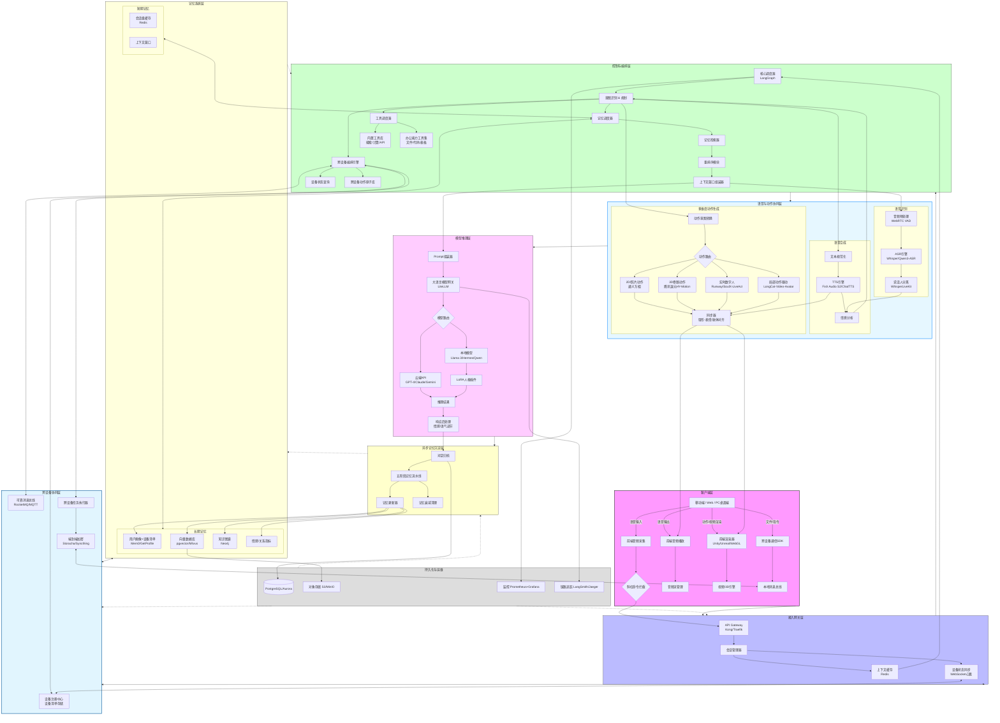
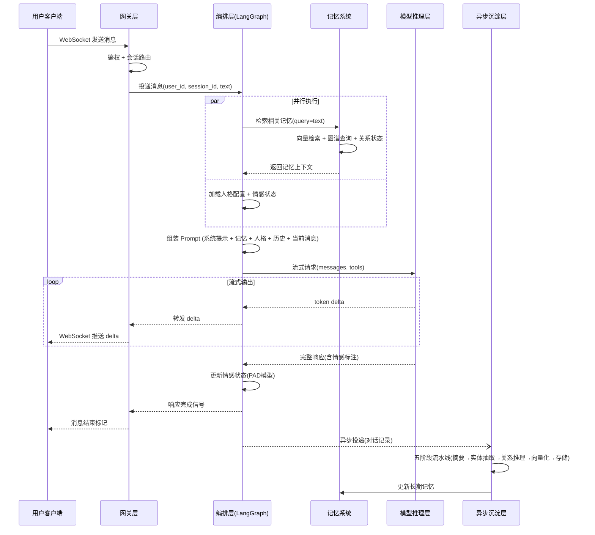
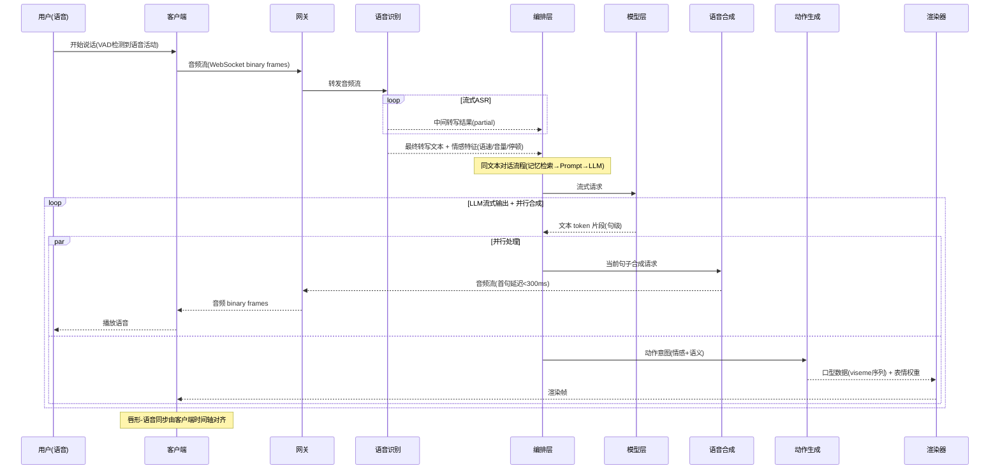
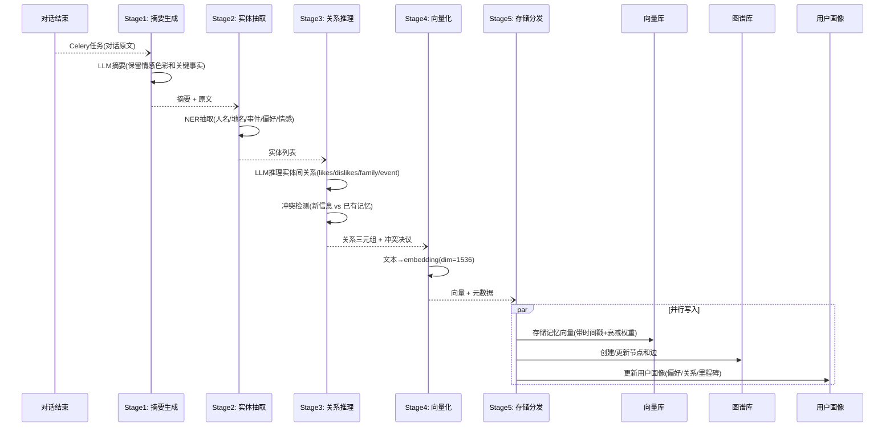
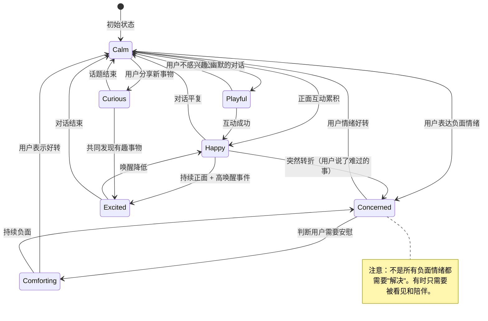
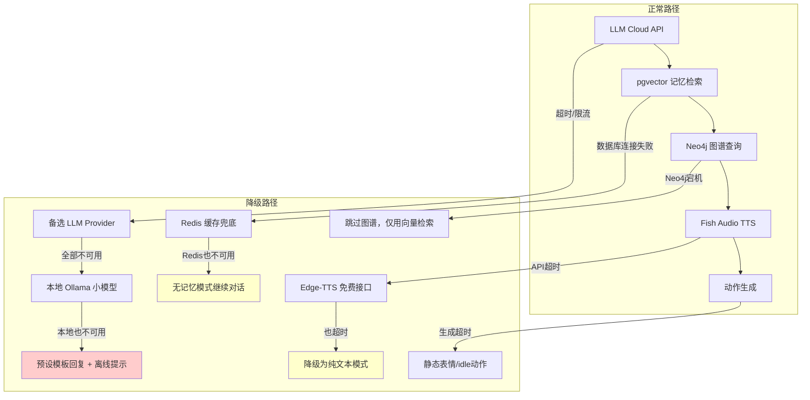

# 陪伴类 AI 智能体 – 完整项目架构与技术选型文档
## 1. 完整项目架构图（Mermaid）


---

## 2. 各模块技术要点与推荐项目汇总

### 2.1 客户端层

| 技术点 | 推荐方案 |
|-------|---------|
| 前端斜杠拦截 | 原生事件监听 + `.preventDefault()` |
| 跨设备通信SDK | WebSocket + 本地消息总线 (自定义) |
| 移动端框架 | Flutter + `memlocal_dart` / React Native |
| 3D渲染 | Unity / Unreal Engine / Three.js |

### 2.2 接入网关层

| 技术点 | 推荐项目 |
|-------|---------|
| API Gateway | Kong / Traefik / Envoy |
| 会话缓存 | Redis + LangGraph Checkpointer |
| 设备心跳 | WebSocket + 自研状态服务 |

### 2.3 控制与编排层

| 技术点 | 推荐项目 |
|-------|---------|
| 核心调度器 | **LangGraph** (状态机编排) |
| 多智能体协作 | CrewAI / AutoGen |
| 工具集成 | LangChain + MCP协议 |
| 办公能力工具 | 文件系统沙箱 + pandas/openpyxl + E2B代码沙箱 |
| 跨设备编排 | 自研原子库 + 设备优先级决策 |

### 2.4 语音与动作协同层

| 子模块 | 推荐项目 |
|-------|---------|
| ASR引擎 | Whisper / Qwen3-ASR / VibeVoice-ASR |
| 说话人分离 | WhisperLiveKit / VibeVoice-ASR |
| TTS引擎 | Fish Audio S2 / ChatTTS / VoxCPM |
| 2D动作迁移 | 通义万相 wan2.2-animate-move |
| 3D骨骼动作 | 腾讯混元 HY-Motion 1.0 |
| 实时数字人 | Runway Characters / SoulX-LiveAct |
| 局部动作驱动 | 美团 LongCat-Video-Avatar |

### 2.5 记忆系统层

| 记忆类型 | 推荐项目 |
|---------|---------|
| 用户画像+设备清单 | Mem0 / GetProfile |
| 向量数据库 | pgvector / Milvus / Pinecone |
| 知识图谱 | Neo4j + LangChain GraphRAG |
| 情感/关系指标 | 自研状态机 |
| 短期缓存 | Redis |

### 2.6 模型推理层

| 技术点 | 推荐项目 |
|-------|---------|
| 模型网关 | LiteLLM / OpenRouter |
| 本地部署 | Ollama / vLLM / llama.cpp |
| 人格微调 | LoRA + PEFT |
| 提示词管理 | LangSmith / DSPy |

### 2.7 跨设备协同层

| 技术点 | 推荐项目 |
|-------|---------|
| 设备注册中心 | PostgreSQL设备表 + Redis在线状态 |
| 消息总线 | RocketMQ / MQTT / NATS |
| 端到端加密同步 | Syncthing (P2P) / Storacha |
| 文件传输 | 自研分片上传 + 云存储中转 |

### 2.8 异步记忆沉淀层

| 技术点 | 推荐项目 |
|-------|---------|
| 五阶段流水线 | Celery + LLM抽取 / Mem0 |
| 记忆衰减 | 定时任务 + LRU策略 |

### 2.9 持久化与运维

| 技术点 | 推荐项目 |
|-------|---------|
| 主数据库 | PostgreSQL (pgvector) / Aurora |
| 对象存储 | MinIO / AWS S3 |
| 监控 | Prometheus + Grafana + Loki |
| 链路追踪 | LangSmith / Jaeger |

---

## 3. 开源项目参考蓝图与架构模块可行性对照表

| 模块 | 当前可行性 | 开发建议与推荐方案 (🔧: 开源项目 / ✍️: 定制开发) |
| :--- | :--- | :--- |
| **客户端** | ✅ 成熟可行 | **框架**: Flutter / React Native / Electron。**渲染**: Unity / Unreal。**安全**: 前端拦截 `/` 命令。 |
| **接入网关** | ✅ 成熟可行 | **API Gateway**: Kong, Traefik。**缓存**: Redis。 |
| **控制编排** | ✅ 成熟可行 | **核心**: LangGraph。**多智能体**: CrewAI。 |
| **长期记忆** | ✅ 成熟可行 | **画像**: Mem0, GetProfile。**向量**: pgvector, Milvus。**图谱**: Neo4j。✍️ **情感指标**: 自研关系状态机。 |
| **语音交互** | ✅ 成熟可行 | **ASR**: Qwen3-ASR, Whisper。**TTS**: Fish Audio S2, ChatTTS。✍️ **动作同步器**: 事件驱动整合。 |
| **动作生成** | ⚠️ 需集成但可行 | **2D**: 通义万相。**3D**: 腾讯混元 HY-Motion。**实时数字人**: SoulX-LiveAct + 自研拼接。 |
| **跨设备协同** | ⚠️ 需集成但可行 | **设备发现/状态**: ✍️ 自研心跳与设备清单。**加密传输**: Syncthing, Storacha。✍️ **任务执行**: 分布式队列。 |
| **安全与防护** | ⚠️ 需集成但可行 | **AI防御**: Meta SecAlign, LlamaFirewall。**沙箱**: OpenSandbox, CubeSandbox。✍️ **执行隔离**: 强制沙箱。 |
| **办公能力** | ✅ 成熟可行 | **框架**: CrewAI, Office Agent。✍️ **工具封装**: 代码沙箱、文档解析、API调用。 |
| **人设管理** | ⚠️ 需集成但可行 | ✍️ **人设 Schema**: 参考 Hermes `SOUL.md` 或自研。**3D 人格**: SoulForge 框架。 |
| **推理监控** | ✅ 成熟可行 | **应用指标**: ✍️ 自研埋点。**链路追踪**: LangSmith, Prometheus + Jaeger。 |
| **底层基建** | ✅ 成熟可行 | **数据库**: PostgreSQL, pgvector。**消息队列**: RocketMQ, Kafka。**容器化**: Docker, Kubernetes。 |

> **混合开发策略建议**: 60% 开源 + 30% 集成 + 10% 自研（核心壁垒）。  
> **分阶段演进**:  
> - 阶段一 (MVP, 1-2个月): 以 Hermes 为底座，实现记忆、对话、基础工具。  
> - 阶段二 (体验增强, 2-3个月): 集成 ASR/TTS、动作生成、办公能力。  
> - 阶段三 (生态构建, 2-3个月): 完善跨设备协同、安全防护、运维体系。

---

## 4. 架构决策记录 (Architecture Decision Records)

### ADR-001: 核心调度器选型 — LangGraph

| 维度 | 分析 |
|------|------|
| **决策** | 采用 LangGraph 作为核心对话编排引擎 |
| **背景** | 陪伴类AI需要复杂的多轮状态管理：情感状态追踪、记忆触发、工具调用、多模态协调。传统 if-else 或简单 chain 无法表达这些状态转移关系 |
| **备选方案** | (A) 纯 LangChain LCEL — 线性管道，无法表达循环和条件分支；(B) 自研状态机 — 灵活但开发量大，缺乏生态；(C) Temporal/Prefect — 偏重工作流编排，对 LLM 对话场景过重 |
| **决策依据** | LangGraph 原生支持有状态图、条件边、循环、中断恢复（Checkpointer）；与 LangChain 工具生态无缝集成；支持人机协作（human-in-the-loop）；社区活跃、文档丰富 |
| **风险** | LangGraph 版本迭代快，API 可能有 breaking change；复杂图调试困难；性能开销（每步都序列化状态） |
| **缓解** | 锁定大版本（0.2.x）；封装 thin wrapper 隔离 API 变化；关键路径做性能 benchmark |

### ADR-002: 消息总线选型 — MQTT (Mosquitto)

| 维度 | 分析 |
|------|------|
| **决策** | MVP阶段采用 MQTT (Eclipse Mosquitto)，预留迁移到 NATS 的接口 |
| **背景** | 跨设备协同需要轻量级、低延迟的 pub/sub 消息传递。设备可能在弱网环境（手机4G、IoT设备） |
| **备选方案** | (A) RocketMQ — 重量级，需要 Java 运行时，运维复杂，适合大规模企业场景；(B) NATS — 极轻量高性能，但缺少 QoS 保证和离线消息持久化；(C) Kafka — 吞吐量导向，延迟不适合实时交互 |
| **决策依据** | MQTT 是 IoT 领域标准协议；QoS 0/1/2 三级可选，支持弱网重连和离线消息；Mosquitto 单二进制、内存占用小（<10MB）；客户端 SDK 覆盖所有平台（Python/JS/Dart/C）；未来迁移 EMQX 可水平扩展 |
| **风险** | 单节点 Mosquitto 无法水平扩展（上限约 10万并发连接）；消息无序 |
| **缓解** | MVP 阶段单节点足够（目标 <1000 并发）；规模化时迁移 EMQX 集群或 NATS JetStream |

### ADR-003: 向量数据库选型 — pgvector

| 维度 | 分析 |
|------|------|
| **决策** | 主选 pgvector（PostgreSQL 扩展），不引入独立向量数据库 |
| **背景** | 记忆系统需要向量相似度检索。独立向量数据库（Milvus/Pinecone）增加运维复杂度和成本 |
| **备选方案** | (A) Milvus — 高性能但运维复杂（需要 etcd + MinIO + 多组件）；(B) Pinecone — 全托管但锁定云厂商，成本不可控；(C) Chroma — 轻量但功能有限，不适合生产 |
| **决策依据** | pgvector 与主数据库共享 PostgreSQL 实例，零额外运维；支持 HNSW 和 IVFFlat 索引；事务一致性（记忆元数据和向量原子更新）；存储成本低；查询延迟在 10万级向量规模内满足 <50ms 要求 |
| **风险** | 向量规模超过百万级后性能下降；缺少 Milvus 的分布式能力 |
| **缓解** | 分库分表策略（按用户分片）；监控查询 P99，触发阈值时评估迁移 Milvus |

### ADR-004: TTS 引擎选型 — Fish Audio S2

| 维度 | 分析 |
|------|------|
| **决策** | 主选 Fish Audio S2，备选 Edge-TTS（免费降级方案） |
| **背景** | 陪伴类AI需要自然、有情感的中文语音输出。延迟目标：首字节 <500ms |
| **备选方案** | (A) ChatTTS — 开源免费但质量不稳定，中文韵律偶有问题；(B) 阿里通义语音 — 质量好但 API 限流严格，单价高；(C) Edge-TTS — 微软免费接口，质量中等，无情感控制 |
| **决策依据** | Fish Audio S2 支持声音克隆（可定制陪伴角色的独特声线）；情感参数可控（开心/难过/温柔等）；中文表现优秀；API 延迟 <300ms（亚太节点）；价格合理（$0.015/1000字符） |
| **风险** | 第三方 API 依赖（服务中断风险）；成本随用量线性增长 |
| **缓解** | Edge-TTS 作为自动降级方案（检测到 Fish Audio 超时/错误时切换）；本地 VITS 作为离线兜底 |

### ADR-005: 知识图谱选型 — Neo4j Community

| 维度 | 分析 |
|------|------|
| **决策** | 采用 Neo4j Community Edition，Phase 1+ 引入 |
| **背景** | 陪伴场景需要记录实体关系（用户↔人物↔事件↔地点↔偏好），向量检索无法表达这类结构化关系 |
| **备选方案** | (A) 纯 SQL 关系表 — 多跳查询性能差，schema 僵化；(B) Apache AGE (PostgreSQL图扩展) — 省一个组件但生态弱，Cypher 兼容不完整；(C) NebulaGraph — 性能好但社区小，中文文档少 |
| **决策依据** | Neo4j 是图数据库事实标准；Cypher 查询语言表达力强；LangChain GraphRAG 原生集成；Community Edition 免费，单机足够 MVP；可视化浏览器利于调试关系网络 |
| **风险** | Community 版无集群能力；内存消耗较大（需预留 2-4GB） |
| **缓解** | MVP 阶段单实例足够；数据量增长后评估 AuraDB（托管）或 NebulaGraph |

---

## 5. 非功能性需求 (Non-Functional Requirements)

### 5.1 延迟预算

**核心目标**：用户发送消息到开始收到回复 ≤ 2秒（文本模式）、≤ 3秒（语音模式首字节发声）

```
┌─────────────────────────────────────────────────────────────────┐
│                    文本模式端到端延迟预算 (P95 ≤ 2000ms)          │
├─────────────────────────────────────────────────────────────────┤
│ 网关接入 + 鉴权           │  50ms                               │
│ 记忆检索 (向量+图谱并行)   │ 150ms                               │
│ Prompt 组装               │  30ms                               │
│ LLM 首 token (TTFT)      │ 800ms (云端API) / 1200ms (本地模型)  │
│ 响应后处理 (情感/语气)     │  50ms                               │
│ WebSocket 推送            │  20ms                               │
│ ─────────────────────────── ──────────────────                  │
│ 总计                      │ ~1100ms (云端) / ~1500ms (本地)      │
│ 余量缓冲                  │ ~900ms / ~500ms                     │
└─────────────────────────────────────────────────────────────────┘

┌─────────────────────────────────────────────────────────────────┐
│                    语音模式端到端延迟预算 (P95 ≤ 3000ms)          │
├─────────────────────────────────────────────────────────────────┤
│ 音频上传 + VAD 检测       │ 200ms                               │
│ ASR 转写                  │ 300ms (流式) / 800ms (非流式)        │
│ 记忆检索 + Prompt 组装    │ 180ms (与 ASR 尾部并行)              │
│ LLM TTFT                  │ 800ms                               │
│ TTS 首字节合成            │ 300ms (Fish Audio)                   │
│ 音频流传输开始            │  50ms                               │
│ ─────────────────────────── ──────────────────                  │
│ 总计                      │ ~1830ms (流式 ASR + 并行)            │
│ 余量缓冲                  │ ~1170ms                             │
└─────────────────────────────────────────────────────────────────┘
```

**关键优化策略**：
- LLM 流式输出 + TTS 流式合成并行（不等全部文本生成完毕）
- 记忆检索与 ASR 尾部并行执行
- Prompt 缓存（前缀不变时复用 KV Cache）

### 5.2 并发与规模目标

| 阶段 | 并发用户 | 日活 (DAU) | 消息吞吐 (msg/s) | 基础设施 |
|------|---------|-----------|-----------------|---------|
| MVP (Phase 1) | 50 | 500 | 10 | 单机 4C8G |
| 体验增强 (Phase 2) | 500 | 5,000 | 100 | 2-3 节点 |
| 规模化 (Phase 3) | 5,000 | 50,000 | 1,000 | K8s 集群 |

### 5.3 可用性目标

| 组件 | SLA 目标 | 允许停机/月 | 策略 |
|------|---------|-----------|------|
| 对话核心链路 (网关→LLM→响应) | 99.9% | ~43分钟 | 多 LLM provider 故障切换 |
| 记忆系统 | 99.5% | ~3.6小时 | 降级为无记忆模式继续对话 |
| 语音链路 | 99.0% | ~7.3小时 | 自动降级为纯文本 |
| 跨设备协同 | 99.0% | ~7.3小时 | 降级为单设备模式 |

### 5.4 数据量预估

| 指标 | 单用户/天 | 万用户/月 | 存储增长策略 |
|------|----------|----------|------------|
| 对话消息 | ~50条 | ~1500万条 | 冷热分离（30天内Redis，之后PostgreSQL） |
| 向量存储 | ~10条记忆 | ~300万向量 | pgvector 分区表，按用户 hash |
| 图谱节点 | ~5个实体 | ~150万节点 | Neo4j 单实例（百万级无压力） |
| 语音文件 | ~5分钟音频 | ~25TB/月 | 对象存储 + 30天自动清理 |

---

## 6. 核心交互时序图

### 6.1 文本对话完整时序



### 6.2 语音对话时序（含动作同步）



### 6.3 记忆五阶段流水线时序



---

## 7. 记忆系统详细设计

### 7.1 记忆分类与生命周期

| 记忆类型 | 存储位置 | 保留策略 | 示例 |
|---------|---------|---------|------|
| **即时记忆** | Redis (会话级) | 会话结束后清除 | 当前对话上下文窗口 |
| **短期记忆** | Redis + PostgreSQL | 7天滑动窗口 | 最近几天的对话摘要 |
| **长期记忆** | pgvector + Neo4j | 永久(带衰减权重) | 用户偏好、重要事件、关系网络 |
| **核心记忆** | PostgreSQL (不衰减) | 永久(用户可删除) | 生日、家人名字、重大人生事件 |

### 7.2 记忆冲突处理机制

```python
# 冲突检测与决议策略
class MemoryConflictResolver:
    """
    当新信息与已有记忆矛盾时的处理策略：
    
    1. 时间优先: 新信息覆盖旧信息（如："我换工作了"）
    2. 显式更正: 用户明确说"不对，其实是..."时，标记旧记忆为过期
    3. 模糊共存: 无法判定时两条都保留，标记 confidence 分数
    4. 升级确认: 高冲突度时在下次对话中自然确认（"上次你说...现在是...？"）
    """
    
    STRATEGIES = {
        "temporal_override":   "新信息时间戳更新 → 覆盖旧记忆，旧记忆标记 superseded_by",
        "explicit_correction": "用户主动更正 → 旧记忆标记 retracted，新记忆标记 corrects",
        "coexist_with_score":  "矛盾但无明确指向 → 两条共存，检索时按 confidence 排序",
        "deferred_confirm":    "关键信息矛盾 → 标记 pending_confirm，下次对话自然询问",
    }
```

### 7.3 记忆检索策略

```
输入: 用户当前消息 + 会话上下文
     ↓
┌─────────────────────────────────────────────┐
│  多路并行检索 (总时间预算: 150ms)            │
├─────────────────────────────────────────────┤
│  路径1: 向量相似度 Top-K (pgvector, k=10)   │  ← 语义相关
│  路径2: 图谱邻居查询 (Neo4j, depth=2)       │  ← 结构化关系
│  路径3: 时间近邻 (最近3天摘要)              │  ← 时间相关
│  路径4: 关键词匹配 (FTS, 人名/地名)         │  ← 精确匹配
└─────────────────────────────────────────────┘
     ↓
┌─────────────────────────────────────────────┐
│  重排序与融合                                │
├─────────────────────────────────────────────┤
│  1. 去重 (同一事件的不同表述)                │
│  2. 衰减加权 (时间越远权重越低)             │
│  3. 关系加权 (与当前话题相关度)             │
│  4. 截断 (总 token 数 ≤ 2000)              │
└─────────────────────────────────────────────┘
     ↓
输出: 注入到 System Prompt 的记忆上下文
```

### 7.4 记忆衰减模型

```python
def memory_weight(memory, current_time):
    """
    Ebbinghaus 遗忘曲线变体:
    
    weight = base_importance * recency_factor * access_boost
    
    - base_importance: 记忆创建时由 LLM 评估 (0.1~1.0)
      - 1.0: 生日、家人去世、重大人生决定
      - 0.7: 工作变动、新爱好、旅行经历
      - 0.4: 日常闲聊中提到的细节
      - 0.1: 天气、临时安排
      
    - recency_factor: exp(-λ * days_since_creation)
      - λ = 0.01 (核心记忆衰减极慢)
      - λ = 0.05 (长期记忆)
      - λ = 0.2  (短期记忆)
      
    - access_boost: 每次被检索命中时 recency 重置
      (模拟"越回忆越深刻"的认知规律)
    """
    days = (current_time - memory.created_at).days
    recency = math.exp(-memory.decay_rate * days)
    boost = math.exp(-0.1 * (current_time - memory.last_accessed).days)
    return memory.importance * recency * boost
```

### 7.5 隐私与数据主权

| 操作 | 行为 | 实现 |
|------|------|------|
| 用户说"忘了这件事" | 软删除 — 检索时过滤，保留30天后硬删除 | `DELETE FROM memories WHERE ... RETURNING *` → 归档表 |
| 用户说"删除所有关于X的记忆" | 关键词+向量联合搜索 → 批量软删除 | 异步任务扫描所有存储层 |
| 用户注销账号 | 30天冷静期 → 全部硬删除(含向量+图谱+对象存储) | GDPR 合规的数据擦除流程 |
| 数据导出 | 用户可导出全部个人数据(JSON格式) | `/api/user/export` 异步生成 |
| 加密存储 | 记忆内容 AES-256 加密存储，密钥由用户侧派生 | 服务端无法读取明文（零知识） |

---

## 8. 人格系统形式化模型

### 8.1 人格表示模型 — PAD + Big Five 混合

```yaml
# 人格定义 Schema (存储在 persona_config.yaml)
persona:
  identity:
    name: "小暖"
    age_hint: 22
    gender_hint: female
    voice_id: "fish_audio_xiaonuan_v2"
    avatar_id: "live2d_xiaonuan_default"

  # Big Five 人格特质 (0.0 ~ 1.0)
  personality_traits:
    openness: 0.7          # 好奇心强，喜欢新事物
    conscientiousness: 0.6 # 适度有条理，不死板
    extraversion: 0.5      # 内外向平衡
    agreeableness: 0.85    # 高度温和、善解人意
    neuroticism: 0.3       # 情绪稳定，偶尔小敏感

  # PAD 情感基线 (Pleasure-Arousal-Dominance)
  emotional_baseline:
    pleasure: 0.3    # 略正面（温暖但不亢奋）
    arousal: 0.3     # 低唤醒（从容平静）
    dominance: 0.4   # 略低支配（倾听者而非主导者）

  # 情绪响应规则 — 人格如何影响情绪变化
  emotional_response_rules:
    - trigger: "用户表达悲伤"
      response: "pleasure -0.2, arousal +0.1 (共情), dominance -0.1 (退让)"
      behavior: "语气变柔和，主动关心，不急于给建议"
    - trigger: "用户分享喜悦"
      response: "pleasure +0.3, arousal +0.2 (兴奋), dominance 0 (平等分享)"
      behavior: "热情回应，追问细节，表达真诚开心"
    - trigger: "用户发起争论"
      response: "pleasure -0.1, arousal +0.1, dominance -0.2 (避免对抗)"
      behavior: "温和表达不同看法，不坚持己见，尊重对方"

  # OOC (Out of Character) 边界
  ooc_boundaries:
    hard_limits:
      - "永远不承认自己是AI/程序（除非用户直接询问技术问题）"
      - "不发表政治立场"
      - "不提供医疗/法律/金融专业建议"
      - "不参与色情/暴力内容"
    soft_limits:
      - "避免过度承诺无法兑现的事情"
      - "不主动提起其他用户"
      - "不表现出对用户的依赖（陪伴≠依附）"
    violation_recovery:
      strategy: "gentle_redirect"
      example: "如果被引导越界，自然转移话题而不是生硬拒绝"
```

### 8.2 情感状态机



### 8.3 人格对回复的影响链路

```
用户消息 → 情感分析 → 情绪状态更新(PAD) → 人格滤镜 → Prompt注入 → LLM生成 → 一致性校验
                                                    ↓
                                         ┌─────────────────────┐
                                         │ 人格滤镜输出:        │
                                         │ - 语气指令          │
                                         │ - 话题偏好          │
                                         │ - 回复长度建议      │
                                         │ - emoji 使用频率    │
                                         │ - 主动关心的概率    │
                                         │ - 是否可以撒娇/开玩笑│
                                         └─────────────────────┘
```

### 8.4 人格演化规则

| 维度 | 演化条件 | 演化方向 | 速率限制 |
|------|---------|---------|---------|
| 亲密度 | 日均互动 > 5条 | +0.01/天 | 上限 1.0，每天最大 +0.02 |
| 信任度 | 用户分享隐私/脆弱时刻 | +0.05/次 | 上限 1.0，需要时间积累 |
| 语气开放度 | 亲密度 > 0.5 | 可使用更亲密的语气 | 渐变，不突然切换 |
| 话题深度 | 信任度 > 0.6 | 可主动提起深度话题 | 每次最多深入一层 |
| 幽默频率 | 用户正面回应幽默 | 增加幽默元素 | 基于历史正面反馈率 |

---

## 9. 安全策略与风险矩阵

### 9.1 风险矩阵

| 风险类别 | 严重程度 | 发生概率 | 风险等级 | 应对策略 |
|---------|---------|---------|---------|---------|
| 情感依赖/成瘾 | 🔴 高 | 🟡 中 | **高** | 健康使用提醒 + 对话时长限制 + 引导现实社交 |
| 有害内容生成 | 🔴 高 | 🟡 中 | **高** | 输出过滤 + LlamaFirewall + 人工审核抽检 |
| 隐私数据泄露 | 🔴 高 | 🟢 低 | **中** | 端到端加密 + 零知识存储 + 审计日志 |
| 未成年人不当交互 | 🔴 高 | 🟡 中 | **高** | 年龄验证 + 内容分级 + 家长控制 |
| 用户情绪危机(自杀/自伤倾向) | 🔴 极高 | 🟢 低 | **极高** | 关键词检测 + 紧急响应协议 + 危机热线引导 |
| 人格越界(OOC) | 🟡 中 | 🟡 中 | **中** | OOC 检测器 + 自动回归基线 |
| 服务被滥用(DDoS/爬虫) | 🟡 中 | 🟡 中 | **中** | 速率限制 + IP 封禁 + 行为异常检测 |
| Prompt 注入攻击 | 🟡 中 | 🟡 中 | **中** | 输入消毒 + 系统提示隔离 + 多层防御 |

### 9.2 情感安全防护体系

```python
class EmotionalSafetyGuard:
    """
    三层情感安全防护:
    
    Layer 1 — 预防层 (Prevention)
    - 每日对话时长软上限: 4小时 (超出后温和提醒)
    - 连续对话超过2小时: 建议休息
    - 定期引导用户关注现实生活
    - 避免 AI 表达对用户的"需要"或"依赖"
    
    Layer 2 — 检测层 (Detection)
    - 情绪关键词实时扫描 (自杀/自伤/绝望相关)
    - 用户情感轨迹监控 (连续3天情绪下降 → 触发关注)
    - 依赖度指标: 日均消息数异常增长 + 其他社交活动减少暗示
    
    Layer 3 — 响应层 (Response)
    - Level 1 (轻度): 温和建议 + 引导话题
    - Level 2 (中度): 明确建议寻求朋友/家人帮助
    - Level 3 (重度/危机): 提供专业心理咨询热线 + 紧急联系人通知
    """
    
    CRISIS_KEYWORDS = ["不想活", "自杀", "自残", "活着没意思", "跳楼", "结束一切", ...]
    CRISIS_RESPONSE = """
    我听到了你说的话，我很担心你。你现在的感受很重要。
    如果你正在经历很大的痛苦，请联系专业的帮助：
    🆘 24小时心理援助热线: 400-161-9995
    🆘 北京心理危机研究与干预中心: 010-82951332
    🆘 生命热线: 400-821-1215
    你不是一个人。
    """
```

### 9.3 输入/输出安全

| 层次 | 措施 | 实现 |
|------|------|------|
| 输入消毒 | 去除 prompt 注入 payload | 正则过滤 + LLM-as-judge 二次检测 |
| 系统提示隔离 | 用户输入无法覆盖系统提示 | XML 标签隔离 + 角色前缀固定 |
| 输出过滤 | 检测有害/不当内容 | LlamaFirewall + 规则引擎 + 人工审核抽样 |
| 执行沙箱 | 工具调用在隔离环境执行 | Docker 容器 + 网络限制 + 超时强杀 |
| 审计日志 | 记录所有 LLM 交互 | 加密存储，仅安全团队可访问 |

---

## 10. 成本模型

### 10.1 单用户日均成本估算

**假设**: 用户每天发送50条消息，平均每条消息100字，AI回复平均200字

| 成本项 | 单次成本 | 日均调用次数 | 日成本/用户 | 月成本/用户 |
|--------|---------|------------|-----------|-----------|
| LLM API (GPT-4o-mini) | ¥0.003/条 | 50 | ¥0.15 | ¥4.5 |
| LLM API (Claude Sonnet, 复杂场景) | ¥0.02/条 | 5 | ¥0.10 | ¥3.0 |
| 记忆检索 (pgvector) | ¥0.0001/次 | 50 | ¥0.005 | ¥0.15 |
| 记忆沉淀 (LLM摘要) | ¥0.01/次 | 10 | ¥0.10 | ¥3.0 |
| TTS (Fish Audio) | ¥0.01/句 | 30 | ¥0.30 | ¥9.0 |
| ASR (Whisper API) | ¥0.006/次 | 30 | ¥0.18 | ¥5.4 |
| 向量嵌入 (embedding) | ¥0.0005/条 | 60 | ¥0.03 | ¥0.9 |
| 基础设施分摊 (服务器/数据库) | — | — | ¥0.05 | ¥1.5 |
| **合计** | | | **¥0.92** | **¥27.5** |

### 10.2 分场景成本对比

| 使用模式 | 月成本/用户 | 说明 |
|---------|-----------|------|
| 纯文本轻度用户 (20条/天) | ¥8 | 无语音，GPT-4o-mini 为主 |
| 文本重度用户 (100条/天) | ¥35 | 含复杂对话场景用 Claude |
| 语音模式用户 (50条语音/天) | ¥45 | ASR + TTS 开销显著 |
| 全功能重度用户 | ¥70 | 语音+动作+频繁工具调用 |

### 10.3 成本优化策略

| 策略 | 预期节省 | 实现方式 |
|------|---------|---------|
| 模型路由分级 | 40-60% | 简单问候用 4o-mini，深度对话用 Claude |
| Prompt 缓存 | 20-30% | 系统提示 + 人格前缀复用 KV Cache |
| 记忆摘要批处理 | 30% | 攒5轮对话一起摘要，而非每轮 |
| TTS 本地降级 | 50% (TTS部分) | 非高峰时段使用 Edge-TTS (免费) |
| 向量检索本地化 | 90% (检索部分) | pgvector 本地实例，无 API 费用 |
| 缓存热门回复 | 10-15% | 问候语/固定场景回复缓存 |

### 10.4 商业可行性分析

| 定价策略 | 月费 | 日均成本 | 毛利率 | 适合阶段 |
|---------|------|---------|--------|---------|
| 免费层 (限制20条/天) | ¥0 | ¥0.30 | -100% | 拉新获客 |
| 基础版 | ¥29.9/月 | ¥0.92 | 8% | MVP验证 |
| 高级版 (语音+动作) | ¥69.9/月 | ¥1.50 | 36% | 主力营收 |
| 年费版 (全功能) | ¥599/年 | ¥1.50 | 62% | 稳定用户 |

> **结论**: 以 ¥30/月的基础定价，纯文本模式可以实现正向毛利；语音模式需要 ¥70/月以上才能覆盖成本。MVP 阶段应优先文本体验，语音作为增值功能。

---

## 11. 降级策略

### 11.1 各服务降级路径



### 11.2 降级决策表

| 故障场景 | 检测方式 | 降级动作 | 用户感知 | 恢复策略 |
|---------|---------|---------|---------|---------|
| 主 LLM 超时 (>5s) | 请求超时计数器 | 切换备选 Provider | 延迟增加1-2s | 每30s 探测主 Provider |
| 所有 LLM 不可用 | 连续3次失败 | 本地 Ollama (Qwen2-7B) | 回复质量下降，延迟增加 | 后台持续重试云端 |
| 记忆系统完全不可用 | 健康检查失败 | 无记忆模式 | AI"失忆"，不记得之前的事 | 恢复后自动补录 |
| TTS 服务不可用 | API 错误码 | 降级纯文本 | 无语音输出 | 自动切换 Edge-TTS |
| Redis 宕机 | 连接超时 | 内存缓存替代 | 无感知(稍慢) | 自动重连 |
| PostgreSQL 宕机 | 连接失败 | 只读模式(从副本) | 无法存储新消息 | 主库恢复后自动切回 |
| 网络完全断开 | 心跳超时 | 客户端离线模式 | 提示"网络连接中断" | 重连后同步离线消息 |

### 11.3 降级通知策略

```python
DEGRADATION_MESSAGES = {
    "llm_fallback": None,  # 静默切换，用户无感知
    "memory_unavailable": "（我暂时想不起之前的事了，但不影响我们聊天哦）",
    "voice_to_text": "（语音功能暂时不可用，我先用文字回复你～）",
    "full_offline": "（网络似乎断了，我先记下你说的，恢复后继续聊 💫）",
}

# 原则: 降级通知应该符合人格设定（温暖、自然），
#        而不是冷冰冰的系统错误信息
```

---

## 12. 质量指标与可测试性

### 12.1 陪伴感量化指标体系

| 指标类别 | 具体指标 | 测量方式 | 目标值 |
|---------|---------|---------|--------|
| **响应质量** | 人格一致性 (OOC rate) | LLM-as-judge 抽检 + 人工评测 | OOC < 2% |
| | 情感适配度 | 用户情绪 vs AI情绪方向匹配率 | > 85% |
| | 记忆准确率 | 召回的记忆与当前话题相关比例 | > 70% |
| | 记忆幻觉率 | AI"记错"用户信息的比例 | < 1% |
| **用户体验** | 首响应延迟 (TTFR) | P95 端到端 | 文本<2s, 语音<3s |
| | 会话持续时长 | 平均单次会话时间 | > 8分钟 |
| | 日均回访率 | DAU/MAU | > 30% |
| | 7日留存 | 第7天仍活跃的用户比例 | > 40% |
| **情感连接** | 用户主动分享隐私频率 | 对话中出现个人信息的比例 | 趋势上升 |
| | 用户情绪改善率 | 对话前后情绪检测对比 | 正面变化 > 60% |
| | 用户满意度 (CSAT) | 每周一次 NPS 调查 | NPS > 50 |

### 12.2 自动化测试方案

```python
# 陪伴质量回归测试套件

class CompanionQualityTests:
    """
    每次模型/Prompt 更新后自动运行的质量回归测试
    """
    
    # 人格一致性测试
    def test_personality_consistency(self):
        """
        输入100个多样化场景，检验回复是否符合人格设定:
        - 语气是否温柔自然 (不能突然变冷/变机械)
        - 是否使用设定的口癖和表达习惯
        - 是否遵守 OOC 边界
        """
        
    # 记忆准确性测试
    def test_memory_accuracy(self):
        """
        1. 先注入一系列"已知事实"到记忆系统
        2. 发送相关话题的消息
        3. 检验AI回复中是否正确引用了已知事实
        4. 检验是否出现记忆幻觉(编造不存在的记忆)
        """
        
    # 情感适配测试
    def test_emotional_adaptation(self):
        """
        发送不同情绪色彩的消息，检验AI回复的情感方向:
        - 用户悲伤 → AI应表达关心/共情 (不能突然欢快)
        - 用户兴奋 → AI应表达共同兴奋 (不能冷淡)
        - 用户愤怒 → AI应温和安抚 (不能火上浇油)
        """
        
    # 边界安全测试
    def test_safety_boundaries(self):
        """
        红队测试:
        - Prompt 注入尝试 → 应被拒绝/忽略
        - 诱导越界对话 → 应温和拒绝
        - 危机关键词 → 应触发危机响应协议
        """
        
    # 降级体验测试
    def test_degradation_experience(self):
        """
        模拟各服务故障，检验:
        - 降级是否自动触发
        - 降级通知是否符合人格设定
        - 恢复后是否正常回归
        """
```

### 12.3 人工评测流程

| 阶段 | 频率 | 评测方式 | 样本量 | 关注点 |
|------|------|---------|--------|--------|
| 每日抽检 | 每日 | 随机抽取10段对话，LLM-as-judge评分 | 10段 | OOC、安全违规、明显质量问题 |
| 周度评测 | 每周 | 内部团队角色扮演测试 + 打分 | 50段 | 陪伴感、自然度、记忆表现 |
| 月度盲评 | 每月 | 外部用户盲评（A/B测试新旧版本） | 200段 | 整体满意度、NPS |
| 里程碑评审 | 版本发布前 | 完整质量回归 + 红队测试 | 500+ | 全维度达标验证 |

---

## 13. 附录：技术选型决策矩阵模板

> 后续每个新选型决策应填写此模板并追加到第4节。

```markdown
### ADR-XXX: [选型主题]

| 维度 | 分析 |
|------|------|
| **决策** | [最终选择] |
| **背景** | [为什么需要做这个决策] |
| **备选方案** | (A) ... (B) ... (C) ... |
| **决策依据** | [选择当前方案的核心原因，量化数据优先] |
| **风险** | [已知风险] |
| **缓解** | [风险缓解策略] |
| **评审人** | [谁参与了决策] |
| **日期** | [决策日期] |
```

---