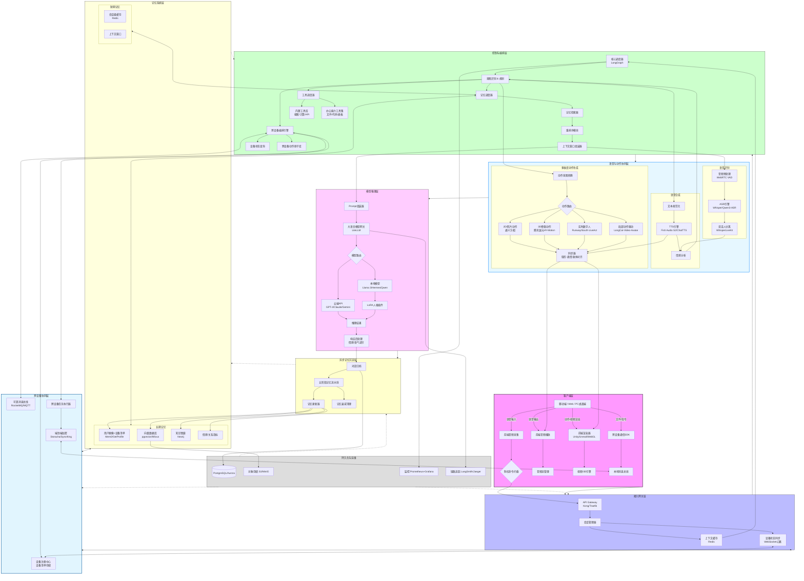

# 陪伴类 AI 智能体 – 完整项目架构与技术选型文档
## 1. 完整项目架构图（Mermaid）

---

## 2. 各模块技术要点与推荐项目汇总

### 2.1 客户端层

| 技术点 | 推荐方案 |
|-------|---------|
| 前端斜杠拦截 | 原生事件监听 + `.preventDefault()` |
| 跨设备通信SDK | WebSocket + 本地消息总线 (自定义) |
| 移动端框架 | Flutter + `memlocal_dart` / React Native |
| 3D渲染 | Unity / Unreal Engine / Three.js |

### 2.2 接入网关层

| 技术点 | 推荐项目 |
|-------|---------|
| API Gateway | Kong / Traefik / Envoy |
| 会话缓存 | Redis + LangGraph Checkpointer |
| 设备心跳 | WebSocket + 自研状态服务 |

### 2.3 控制与编排层

| 技术点 | 推荐项目 |
|-------|---------|
| 核心调度器 | **LangGraph** (状态机编排) |
| 多智能体协作 | CrewAI / AutoGen |
| 工具集成 | LangChain + MCP协议 |
| 办公能力工具 | 文件系统沙箱 + pandas/openpyxl + E2B代码沙箱 |
| 跨设备编排 | 自研原子库 + 设备优先级决策 |

### 2.4 语音与动作协同层

| 子模块 | 推荐项目 |
|-------|---------|
| ASR引擎 | Whisper / Qwen3-ASR / VibeVoice-ASR |
| 说话人分离 | WhisperLiveKit / VibeVoice-ASR |
| TTS引擎 | Fish Audio S2 / ChatTTS / VoxCPM |
| 2D动作迁移 | 通义万相 wan2.2-animate-move |
| 3D骨骼动作 | 腾讯混元 HY-Motion 1.0 |
| 实时数字人 | Runway Characters / SoulX-LiveAct |
| 局部动作驱动 | 美团 LongCat-Video-Avatar |

### 2.5 记忆系统层

| 记忆类型 | 推荐项目 |
|---------|---------|
| 用户画像+设备清单 | Mem0 / GetProfile |
| 向量数据库 | pgvector / Milvus / Pinecone |
| 知识图谱 | Neo4j + LangChain GraphRAG |
| 情感/关系指标 | 自研状态机 |
| 短期缓存 | Redis |

### 2.6 模型推理层

| 技术点 | 推荐项目 |
|-------|---------|
| 模型网关 | LiteLLM / OpenRouter |
| 本地部署 | Ollama / vLLM / llama.cpp |
| 人格微调 | LoRA + PEFT |
| 提示词管理 | LangSmith / DSPy |

### 2.7 跨设备协同层

| 技术点 | 推荐项目 |
|-------|---------|
| 设备注册中心 | PostgreSQL设备表 + Redis在线状态 |
| 消息总线 | RocketMQ / MQTT / NATS |
| 端到端加密同步 | Syncthing (P2P) / Storacha |
| 文件传输 | 自研分片上传 + 云存储中转 |

### 2.8 异步记忆沉淀层

| 技术点 | 推荐项目 |
|-------|---------|
| 五阶段流水线 | Celery + LLM抽取 / Mem0 |
| 记忆衰减 | 定时任务 + LRU策略 |

### 2.9 持久化与运维

| 技术点 | 推荐项目 |
|-------|---------|
| 主数据库 | PostgreSQL (pgvector) / Aurora |
| 对象存储 | MinIO / AWS S3 |
| 监控 | Prometheus + Grafana + Loki |
| 链路追踪 | LangSmith / Jaeger |

---

## 3. 开源项目参考蓝图与架构模块可行性对照表

| 模块 | 当前可行性 | 开发建议与推荐方案 (🔧: 开源项目 / ✍️: 定制开发) |
| :--- | :--- | :--- |
| **客户端** | ✅ 成熟可行 | **框架**: Flutter / React Native / Electron。**渲染**: Unity / Unreal。**安全**: 前端拦截 `/` 命令。 |
| **接入网关** | ✅ 成熟可行 | **API Gateway**: Kong, Traefik。**缓存**: Redis。 |
| **控制编排** | ✅ 成熟可行 | **核心**: LangGraph。**多智能体**: CrewAI。 |
| **长期记忆** | ✅ 成熟可行 | **画像**: Mem0, GetProfile。**向量**: pgvector, Milvus。**图谱**: Neo4j。✍️ **情感指标**: 自研关系状态机。 |
| **语音交互** | ✅ 成熟可行 | **ASR**: Qwen3-ASR, Whisper。**TTS**: Fish Audio S2, ChatTTS。✍️ **动作同步器**: 事件驱动整合。 |
| **动作生成** | ⚠️ 需集成但可行 | **2D**: 通义万相。**3D**: 腾讯混元 HY-Motion。**实时数字人**: SoulX-LiveAct + 自研拼接。 |
| **跨设备协同** | ⚠️ 需集成但可行 | **设备发现/状态**: ✍️ 自研心跳与设备清单。**加密传输**: Syncthing, Storacha。✍️ **任务执行**: 分布式队列。 |
| **安全与防护** | ⚠️ 需集成但可行 | **AI防御**: Meta SecAlign, LlamaFirewall。**沙箱**: OpenSandbox, CubeSandbox。✍️ **执行隔离**: 强制沙箱。 |
| **办公能力** | ✅ 成熟可行 | **框架**: CrewAI, Office Agent。✍️ **工具封装**: 代码沙箱、文档解析、API调用。 |
| **人设管理** | ⚠️ 需集成但可行 | ✍️ **人设 Schema**: 参考 Hermes `SOUL.md` 或自研。**3D 人格**: SoulForge 框架。 |
| **推理监控** | ✅ 成熟可行 | **应用指标**: ✍️ 自研埋点。**链路追踪**: LangSmith, Prometheus + Jaeger。 |
| **底层基建** | ✅ 成熟可行 | **数据库**: PostgreSQL, pgvector。**消息队列**: RocketMQ, Kafka。**容器化**: Docker, Kubernetes。 |

> **混合开发策略建议**: 60% 开源 + 30% 集成 + 10% 自研（核心壁垒）。  
> **分阶段演进**:  
> - 阶段一 (MVP, 1-2个月): 以 Hermes 为底座，实现记忆、对话、基础工具。  
> - 阶段二 (体验增强, 2-3个月): 集成 ASR/TTS、动作生成、办公能力。  
> - 阶段三 (生态构建, 2-3个月): 完善跨设备协同、安全防护、运维体系。
---